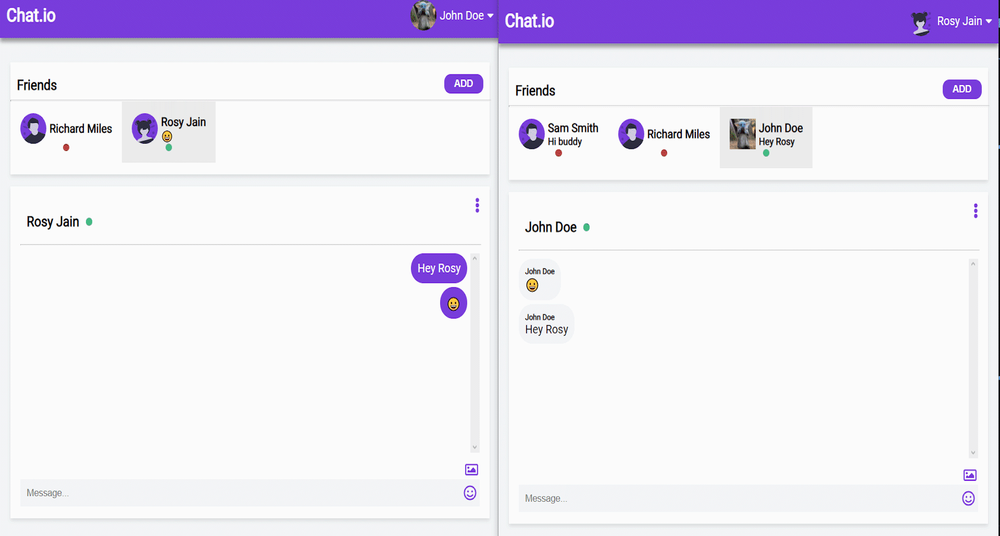

<div align="center">


# CHAT<span>.</span>IO


<!-- 


[](https://github.com/blackphoenix42/chat-app/blob/master/LICENSE) -->


</div>

# 📃 About

A chat app where users can send messages to each other. This project’s backend and frontend has an authentication system. It achieves real-time communication using `socket.io` and has many amazing features. 

### Few Awesome Features 🕹

- Send and receive messages in real-time 📧
<div align="center"></div>

- Update Profile 👨🏻‍🏫
<div align="center"></div>

- Upload and send files 📁
<div align="center"></div>
  

# 🌱 Quick Start

- Star🌟 and Fork this repository

- Clone this repository remotely.

```sh
git clone https://github.com/blackphoenix42/chat-app.git`
```

### Backend 🌐

- Download and install [PostgreSQL](https://www.postgresql.org/download/)🐘

- Navigate to backend directory

```sh
cd .\backend\
```

- Install the dependencies

```sh
npm install
```

- Add PostgresSQL databse password in `.env.EXAMPLE` file and remove `.EXAMPLE` from the extension.

- Create `chat_app` database in pgAdmin. (You can provide a different name but change it too in the `.env` file.)

- In the terminal, run the following command to create tables in database

```sh
npx sequelize-cli db:migrate
```

- Send dummy data to the database.

```sh
npx sequelize-cli db:seed:all
```

- Start the server

```sh
npm start
```

### Frontend 💻

- Navigate to frontend directory

```sh
cd .\frontend\
```

- Install the dependencies

```sh
npm install
```

- Start the app

```sh
npm start
```

<div align="center"></div>

# 🔑Credentials

Use following credentials to try out the app.

```
email:john.doe@gmail.com
password:secret
```

# 📚 Technology Stack

- React
- Nodejs
- Express
- PostgreSQL

## 🚀 How to Contribute to Chat-App?

- Take a look at the Existing [Issues](https://github.com/blackphoenix42/chat-app/issues) or create your own Issues!
- Check out [CONTRIBUTING.md](./CONTRIBUTING.md)
- Start contributing to add yourself in README.md 🤙🏻

<div align="center"></div>

## 👾 Project Admin

<table>
	<tr>
		<td align="center">
			<a href="https://github.com/blackphoenix42">
				
				<br /> <sub><b>blackphoenix42</b></sub>
			</a>
			<br /> <a href="https://github.com/blackphoenix42"> 
		👑 Admin
	    </a>
		</td>
	</tr>
</table>

<!-- ## 🌟 Contributors

<table>
	<tr>
		<td>
			contrib.rocks
			</a>
		</td>
	</tr>
</table> -->
